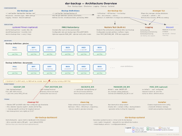

<!-- markdownlint-disable MD024 -->
# `dar-backup`

**Long-term archival backups for Linux — with integrity you can prove and repair**

[](https://codecov.io/gh/per2jensen/dar-backup)
[](https://security.snyk.io/vuln/?search=dar-backup)

[](https://pypi.org/project/dar-backup/)
[](https://pypi.org/project/dar-backup/)
[](https://github.com/per2jensen/dar-backup/blob/main/clonepulse/weekly_clones.png)
[](https://github.com/per2jensen/dar-backup/blob/main/clonepulse/weekly_clones.png)  <sub>🎯 Stats powered by [ClonePulse](https://github.com/per2jensen/clonepulse)</sub>

`dar-backup` is for Linux users who want **serious, long-term backups** — not just file copies.
It automates FULL / DIFF / INCR archive cycles built on two exceptional open-source tools:

- **[dar](https://github.com/Edrusb/DAR)** (Disk ARchiver) — a powerful, actively maintained
  archiver by Denis Corbin that handles differential and incremental archives, built-in
  verification, catalogue databases, and precise file selection. `dar` is the engine that makes
  long-term archival practical. It deserves to be far better known than it is.
- **[par2cmdline](https://github.com/Parchive/par2cmdline)** — the Parchive suite's
  implementation of PAR2, a Reed-Solomon based redundancy format that can detect and repair
  corruption in any file, years after the fact, with no connection to the original source.
  A quiet but remarkable piece of technology.

`dar-backup` wires these two tools together into a fully automated backup system, with every
archive verified and restore-tested before the job completes.

**Is this for you?**

✅ You back up irreplaceable data — photos, documents, home-made video — and want to be
   certain you can restore any file to any point in time, years from now

✅ You run backups as a **normal user** — root is not required, and FUSE-mounted filesystems (Nextcloud, rclone, sshfs) work correctly

✅ You want **bitrot repair** to travel with your archives — onto USB disks, offsite copies, and cloud storage — without depending on the original system

✅ You want unattended, scheduled backups with **Discord notifications** on success or failure

✅ You want a transparent, no-lock-in tool built on proven Unix components

✗ You need a GUI, Windows support, or just a quick incremental sync — `rsync` or `restic` may suit you better

---

## TL;DR

```bash
# prep
sudo apt -y install dar par2 python3 python3-venv
INSTALL_DIR=/tmp/dar-backup; mkdir "$INSTALL_DIR" && cd "$INSTALL_DIR"
python3 -m venv venv    # create a virtual environment
. venv/bin/activate     # activate the virtual environment
# install and run dar-backup
pip install dar-backup
demo --install && manager --create-db
dar-backup --full-backup
```

`dar-backup` runs FULL, DIFF, and INCR backup cycles across as many backup definitions as you
need (e.g. `photos`, `documents`, `homevideos`). After each archive it:

1. **Verifies** the archive with `dar -t`
2. **Restore-tests** a random sample of files and compares them byte-for-byte against the source
3. **Creates PAR2 redundancy files** so the archive can be repaired if bitrot occurs later
4. **Notifies** your Discord channel on completion or failure

Schedules are managed by systemd timers (generated for you). Catalogs of every archive are
maintained by `dar_manager`, enabling single-file Point-in-Time Recovery without a database
server.

Version **1.1.2** · reached **1.0.0** on October 9, 2025 · [Changelog](CHANGELOG.md)

---

## Why not just use restic / BorgBackup / rsync?

Those are excellent tools. `dar-backup` fills a different niche:

| Concern | dar-backup |
|---|---|
| Run as non-root on FUSE mounts | ✅ designed for this |
| Bitrot repair without re-downloading | ✅ PAR2 travels with the archive |
| Restore a single file to a specific date | ✅ PITR via dar_manager catalogs |
| No dependency on original system to restore | ✅ one static `dar` binary is enough |
| Archive integrity testable anywhere | ✅ `par2verify` + `dar -t` work offline |
| Transparent, auditable backup content | ✅ `dar` archives are well-documented |

If your threat model is *"I need to recover a file I deleted three months ago, on a machine I
no longer have, from a USB disk I kept offsite"* — `dar-backup` is built for exactly that.

---

## Features

- **FULL / DIFF / INCR backup cycles** — per backup definition, independently scheduled
- **Automatic archive verification** — `dar -t` after every backup run
- **Automatic restore test** — random files extracted and compared to source after each backup;
  configurable excludes for cache dirs, temp files, locks
- **PAR2 redundancy** — configurable coverage per backup type (FULL/DIFF/INCR);
  optionally stored in a separate directory (different device or offsite mount)
- **Point-in-Time Recovery** — `dar_manager` catalogs let you locate and restore any file
  to any date across your full archive history
- **Metrics and dashboard** - optional [detailed metrics](v2/doc/dashboard-and-metrics.md#metrics-database) and [dashboard](v2/doc/dashboard-and-metrics.md#dashboard)
- **Runs as a normal user** — no root needed; works correctly on FUSE-mounted filesystems
- **systemd integration** — timer units generated for you with sensible default schedules
- **Discord notifications** — webhook alerts on backup success or failure, from all CLI tools
- **Shell autocompletion** — bash and zsh, context-aware (archive names filtered by definition)
- **Clean logging** — three log files (main, command output, trace/debug), all rotating and
  size-capped; `clean-log` strips verbose `dar` output when not needed
- **No lock-in** — standard `dar` archives, standard PAR2 files; restore with just the `dar`
  binary, no `dar-backup` installation required on the restore machine
- **750+ tests** — unit and integration tests covering PAR2 bitrot repair, full/diff/incr
  restore chains, PITR verification, and edge cases; CI on every commit

✅ The author has used `dar-backup` ~5 years and has been saved by it multiple times.

> `dar-backup` stands on the shoulders of two projects that do the real work.
> Sincere thanks to **Denis Corbin** for `dar`, and to the **Parchive team** for `par2`.
> If you find `dar-backup` useful, consider giving those projects a star too.

---

## High-level architecture

[](v2/doc/dar-backup-overview.png)

---

## Documentation

| Document | Description |
|---|---|
| [Quick Guide](#quick-guide) | Get started in minutes |
| [Configuration Reference](v2/doc/config-reference.md) | Config file, .darrc, backup definitions, config history |
| [Restoring](v2/doc/restoring.md) | Point-in-Time Recovery (PITR), restore examples |
| [PAR2 Redundancy](v2/doc/par2.md) | Verify, repair, and create PAR2 files |
| [systemd Setup](v2/doc/systemd-setup.md) | Generate and install systemd timers/services |
| [Shell Autocompletion](v2/doc/shell-completion.md) | Bash and zsh tab-completion setup |
| [Dashboard & Metrics](v2/doc/dashboard-and-metrics.md) | Metrics database, Datasette, dashboard |
| [dar Tips](v2/doc/dar-tips.md) | File selection, merging archives, logging tips |
| [CLI Reference](v2/doc/cli-reference.md) | All command options, exit codes, env vars |
| [Troubleshooting](v2/doc/troubleshooting.md) | Error codes, FUSE issues, special characters |
| [Development](v2/doc/dev.md) | Dev setup, testing, PyPI, building dar |
| [Changelog](CHANGELOG.md) | High-level release history |
| [Detailed Changelog](v2/Changelog.md) | Per-release details |

---

## My use case

I needed the following:

- Backup my workstation to a remote server
- Backup primarily photos, home made video and different types of documents
- I have cloud storage mounted on a directory within my home dir. The filesystem is [FUSE based](https://www.kernel.org/doc/html/latest/filesystems/fuse.html), which gives it a few special features
  - Backup my cloud storage (cloud is convenient, but I want control over my backups)
  - A non-privileged user can perform a mount
  - A privileged user cannot look into the filesystem --> a backup script running as root is not suitable

- Have a simple way of restoring, possibly years into the future. 'dar' fits that scenario with a single statically linked binary (kept with the archives). There is no need install/configure anything - restoring is simple and works well.
- During backup archives must be tested and a restore test (however small) performed
- Archives stored on a server with a reliable file system (easy to mount a directory over sshfs)
- Easy to verify archive's integrity, after being moved around.

 I do not need the encryption features of dar, as all storage is already encrypted.

## My setup

1. Primary backup to server with an ext4 file system on mdadm RAID1

2. Secondary copies to multiple USB disks / cloud

3. Archive integrity verification anywhere using [Par2](v2/doc/par2.md) and `dar -t`.

4. Archive repair anywhere if needed. By default `dar-backup` creates par2 redundancy files with 5% coverage. Enough to fix localized bitrot.

5. No dependency on original system

### Why PAR2 is especially good for portable / offsite copies

PAR2 parity is:

> Self-contained (travels with the data)
>
>Format-agnostic (works on any filesystem)
>
>Location-agnostic (local disk, USB, cloud object storage)
>
>Tool-stable (PAR2 spec has not changed in years)
>
>That means:
>
>**Integrity protection moves with the archive**.

### Design choices

My design choices are boring, proven and pragmatic:
>
>mdadm handles disks
>
>PAR2 handles data integrity
>
>You control when and how verification happens
>
>Errors have a fair chance of being diagnosed and fixed, due to well known tooling.
>
>No hidden magic, no lock-in

---

## Quick Guide

This purpose of this quick guide is to show how `dar-backup` works in a few simple steps.

The package include a `demo`application, that can help you set up `dar-backup` quickly.

> ⚠️ **Assumption**
>
> The demo program uses these directories in your home directory:
>
> - $HOME/dar-backup
> - $HOME/.config/dar-backup
>
> It is assumed they **do not exist** before running the demo.
>
> Python **>= 3.11** is required

<br>

**Let's roll** with installation, backup, list backup content, restore & restore check

The demo is known to work on an Ubuntu 24.04 clean VM as delivered from `Multipass`

```bash
sudo apt -y install dar par2 python3 python3-venv
INSTALL_DIR=/tmp/dar-backup
mkdir "$INSTALL_DIR"
cd "$INSTALL_DIR"
python3 -m venv venv    # create the virtual environment
. venv/bin/activate     # activate the virtual environment
pip install dar-backup  # run pip to install `dar-backup` into the virtual environment
```

<details>

<summary>🎯 Install details</summary>

```bash
(venv) $ INSTALL_DIR=/tmp/dar-backup
mkdir "$INSTALL_DIR"
cd "$INSTALL_DIR"
python3 -m venv venv    # create the virtual environment
. venv/bin/activate     # activate the virtual environment
pip install dar-backup  # run pip to install `dar-backup`
Collecting dar-backup
  Downloading dar_backup-0.6.21-py3-none-any.whl.metadata (88 kB)
     ━━━━━━━━━━━━━━━━━━━━━━━━━━━━━━━━━━━━━━━━ 88.5/88.5 kB 3.7 MB/s eta 0:00:00
Collecting argcomplete>=3.6.2 (from dar-backup)
  Using cached argcomplete-3.6.2-py3-none-any.whl.metadata (16 kB)
Collecting inputimeout>=1.0.4 (from dar-backup)
  Using cached inputimeout-1.0.4-py3-none-any.whl.metadata (2.2 kB)
Collecting rich>=13.0.0 (from dar-backup)
  Using cached rich-14.0.0-py3-none-any.whl.metadata (18 kB)
Collecting markdown-it-py>=2.2.0 (from rich>=13.0.0->dar-backup)
  Using cached markdown_it_py-3.0.0-py3-none-any.whl.metadata (6.9 kB)
Collecting pygments<3.0.0,>=2.13.0 (from rich>=13.0.0->dar-backup)
  Using cached pygments-2.19.1-py3-none-any.whl.metadata (2.5 kB)
Collecting mdurl~=0.1 (from markdown-it-py>=2.2.0->rich>=13.0.0->dar-backup)
  Using cached mdurl-0.1.2-py3-none-any.whl.metadata (1.6 kB)
Downloading dar_backup-0.6.21-py3-none-any.whl (101 kB)
   ━━━━━━━━━━━━━━━━━━━━━━━━━━━━━━━━━━━━━━━━ 101.9/101.9 kB 16.2 MB/s eta 0:00:00
Using cached argcomplete-3.6.2-py3-none-any.whl (43 kB)
Using cached inputimeout-1.0.4-py3-none-any.whl (4.6 kB)
Using cached rich-14.0.0-py3-none-any.whl (243 kB)
Using cached markdown_it_py-3.0.0-py3-none-any.whl (87 kB)
Using cached pygments-2.19.1-py3-none-any.whl (1.2 MB)
Using cached mdurl-0.1.2-py3-none-any.whl (10.0 kB)
Installing collected packages: pygments, mdurl, inputimeout, argcomplete, markdown-it-py, rich, dar-backup
Successfully installed argcomplete-3.6.2 dar-backup-0.6.21 inputimeout-1.0.4 markdown-it-py-3.0.0 mdurl-0.1.2 pygments-2.19.1 rich-14.0.0
```

</details>

Setup the demo configurations and show a few operations

<br>

```bash
# See reference section for options tweaking the install
demo --install

# create catalog database
manager --create-db

# FULL backup as defined in backup definition `demo`
dar-backup --full-backup

# List the contents of the backup
dar-backup --list-contents demo_FULL_$(date '+%F')
```

<details>

<summary>🎯 --list details</summary>

```bash
(venv) $ demo --install
Directories created.
File generated at '/home/user/.config/dar-backup/backup.d/demo'
File generated at '/home/user/.config/dar-backup/dar-backup.conf'
1. Now run `manager --create-db` to create the catalog database.
2. Then you can run `dar-backup --full-backup` to create a backup.
3. List backups with `dar-backup --list`
4. List contents of a backup with `dar-backup --list-contents <backup-name>`


(venv) $ manager --create-db
========== Startup Settings ==========
manager.py:     0.7.1
Config file:    /home/user/.config/dar-backup/dar-backup.conf
Logfile:        /home/user/dar-backup/dar-backup.log
dar_manager:    /home/user/.local/dar/bin/dar_manager
dar_manager v.: 1.9.0
======================================


(venv) $ dar-backup --full-backup
========== Startup Settings ==========
dar-backup.py:    0.7.1
dar path:         /home/user/.local/dar/bin/dar
dar version:      2.7.17
Script directory: /home/user/git/dar-backup/v2/src/dar_backup
Config file:      /home/user/.config/dar-backup/dar-backup.conf
.darrc location:  /home/user/git/dar-backup/v2/src/dar_backup/.darrc
======================================


(venv) $ dar-backup --list-contents demo_FULL_$(date '+%F')
========== Startup Settings ==========
dar-backup.py:    0.7.1
dar path:         /home/user/.local/dar/bin/dar
dar version:      2.7.17
Script directory: /home/user/git/dar-backup/v2/src/dar_backup
Config file:      /home/user/.config/dar-backup/dar-backup.conf
.darrc location:  /home/user/git/dar-backup/v2/src/dar_backup/.darrc
======================================
[Saved][-]       [-L-][  49%][ ]  drwx------   user user  8 kio Sat May 17 13:13:59 2025  .config
[Saved][-]       [-L-][  49%][ ]  drwxrwxr-x   user user  8 kio Tue May  6 20:55:40 2025  .config/dar-backup
[Saved][-]       [-L-][  48%][ ]  drwxrwxr-x   user user  6 kio Sat May 17 13:26:21 2025  .config/dar-backup/backup.d
[Saved][ ]       [-L-][  40%][ ]  -rw-rw-r--   user user  764 o Sun Feb 23 21:23:01 2025  .config/dar-backup/backup.d/media-files
[Saved][ ]       [-L-][  41%][ ]  -rw-rw-r--   user user  933 o Sun Feb 23 21:23:15 2025  .config/dar-backup/backup.d/pCloudDrive
[Saved][ ]       [-L-][  48%][ ]  -rw-rw-r--   user user  1 kio Sun Mar 16 10:40:29 2025  .config/dar-backup/backup.d/test
[Saved][ ]       [-L-][  48%][ ]  -rw-rw-r--   user user  824 o Tue May 13 17:00:52 2025  .config/dar-backup/backup.d/default
[Saved][ ]       [-L-][  48%][ ]  -rw-rw-r--   user user  1 kio Sat May  3 10:40:33 2025  .config/dar-backup/backup.d/user-homedir
[Saved][ ]       [-L-][  54%][ ]  -rw-rw-r--   user user  1 kio Sat May 17 18:17:40 2025  .config/dar-backup/backup.d/demo
[Saved][ ]       [-L-][  55%][ ]  -rw-rw-r--   user user  1 kio Sat May 17 18:17:40 2025  .config/dar-backup/dar-backup.conf
```

</details>

<br>

Perform a restore and show the restored files

```bash
# Restore all files in the backup
dar-backup --restore demo_FULL_$(date '+%F') --verbose

# Prove the files have been restored to directory as configured
find $HOME/dar-backup/restore
```

<details>

<summary>🎯 --restore details</summary>

```bash
(venv) $ dar-backup --restore demo_FULL_$(date '+%F') --verbose
========== Startup Settings ==========
dar-backup.py:    0.7.1
dar path:         /home/user/.local/dar/bin/dar
dar version:      2.7.17
Script directory: /home/user/git/dar-backup/v2/src/dar_backup
Config file:      /home/user/.config/dar-backup/dar-backup.conf
.darrc location:  /home/user/git/dar-backup/v2/src/dar_backup/.darrc
Backup.d dir:     /home/user/.config/dar-backup/backup.d
Backup dir:       /home/user/dar-backup/backups
Restore dir:      /home/user/dar-backup/restore
Logfile location: /home/user/dar-backup/dar-backup.log
PAR2 enabled:     True
--do-not-compare: False
======================================


(venv) $ find ~/dar-backup/restore/
/home/user/dar-backup/restore/
/home/user/dar-backup/restore/.config
/home/user/dar-backup/restore/.config/dar-backup
/home/user/dar-backup/restore/.config/dar-backup/backup.d
/home/user/dar-backup/restore/.config/dar-backup/backup.d/media-files
/home/user/dar-backup/restore/.config/dar-backup/backup.d/pCloudDrive
/home/user/dar-backup/restore/.config/dar-backup/backup.d/test
/home/user/dar-backup/restore/.config/dar-backup/backup.d/default
/home/user/dar-backup/restore/.config/dar-backup/backup.d/user-homedir
/home/user/dar-backup/restore/.config/dar-backup/backup.d/demo
/home/user/dar-backup/restore/.config/dar-backup/dar-backup.conf
```

</details>

<br>

> ✅ **Next steps**
>
> Play with `demo's` options:
>
> - --root-dir      (perhaps $HOME)
> - --dir-to-backup (perhaps Pictures)
> - --backup-dir    (perhaps /media/user/big-disk)
>
> See log file: `cat "$HOME/dar-backup/dar-backup.log"`
>
> Checkout [systemd timers and services](v2/doc/systemd-setup.md)
>
> Checkout [shell autocompletion (very nice !)](v2/doc/shell-completion.md)
>
> Checkout the [CLI reference](v2/doc/cli-reference.md)

---

## dar-backup principles

### dar-backup overview

[](v2/doc/dar-backup-overview.png)

### dar-backup

`dar-backup` is built in a way that emphasizes getting backups. It loops over the backup definitions, and in the event of a failure while backing up a backup definition, dar-backup shall log an error and start working on the next backup definition.

There are 3 levels of backups, FULL, DIFF and INCR.

- The author does a FULL yearly backup once a year. This includes all files in all directories as defined in the backup definition(s) (assuming `-d` was not given).
- The author makes a DIFF once a month. The DIFF backs up new and changed files **compared** to the **FULL** backup.

  - No DIFF backups are taken until a FULL backup has been taken for a particular backup definition.

- The author takes an INCR backup every 3 days. An INCR backup includes new and changed files **compared** to the **DIFF** backup.

  - So, a set of INCR's will contain duplicates (this might change as I become more used to use the catalog databases)

  - No INCR backups are taken until a DIFF backup has been taken for a particular backup definition.

After each backup of a backup definition, `dar-backup` tests the archive and then performs a few restore operations of random files from the archive (see [config file](v2/doc/config-reference.md#config-file)). The restored files are compared to the originals to check if the restore went well.

`dar-backup` skips doing a backup of a backup definition if an archive is already in place. So, if you for some reason need to take a new backup on the same date, the first archive must be deleted (I recommend using [cleanup](v2/doc/cli-reference.md#cleanup-options)).

### cleanup

The `cleanup` application deletes DIFF and INCR if the archives are older than the thresholds set up in the configuration file.

`cleanup` will only remove FULL archives if the option  `--cleanup-specific-archives` is used. It requires the user to confirm deletion of FULL archives.

Use `--dry-run` to preview which archives, PAR2 files, and catalogs would be removed without deleting anything.

Examples:

```bash
cleanup --dry-run -d media-files --log-stdout
cleanup --dry-run --cleanup-specific-archives -d media-files media-files_INCR_2025-12-22
```

### manager

`dar`has the concept of catalogs which can be exported and optionally be added to a catalog database. That database makes it much easier to restore the correct version of a backed up file if for example a target date has been set.

`dar-backup` adds archive catalogs to their databases (using the `manager` script). Should the operation fail, `dar-backup` logs an error and continue with testing and restore validation tests.

---

## How to run

📦 All official dar-backup releases from v2-beta-0.6.18 are signed with GPG.

See more [here](#gpg-signing-key).

### 1 - installation

Installation is currently in a [virtual environment](https://csguide.cs.princeton.edu/software/virtualenv) (commonly called a `venv`). These commands are installed in the venv:

- dar-back
- cleanup
- manager
- clean-log
- dar-backup-systemd
- installer
- demo

Note:

The modules `inputimeout`, `rich`and `argcomplete` are installed into the venv and used by `dar-backup`

To install `dar-backup`, create a venv and run pip:

```bash
mkdir $HOME/tmp
cd $HOME/tmp
python3 -m venv venv    # create the virtual environment
. venv/bin/activate     # activate the virtual environment
pip install dar-backup  # run pip to install `dar-backup`
```

I have an alias in ~/.bashrc pointing to my venv:

```bash
alias db=". ~/tmp/venv/bin/activate; dar-backup -v"
```

drop the alias into ~/.bashrc like this:

```bash
grep -qxF 'alias db="' ~/.bashrc \
  || echo 'alias db=". ~/tmp/venv/bin/activate; dar-backup -v"' >> ~/.bashrc

source ~/.bashrc
```

Typing `db` at the command line gives something like this:

```bash
(venv) user@machine:~$ db
dar-backup 0.6.12
dar-backup.py source code is here: https://github.com/per2jensen/dar-backup
Licensed under GNU GENERAL PUBLIC LICENSE v3, see the supplied file "LICENSE" for details.
THERE IS NO WARRANTY FOR THE PROGRAM, TO THE EXTENT PERMITTED BY APPLICABLE LAW, not even for MERCHANTABILITY or FITNESS FOR A PARTICULAR PURPOSE.
See section 15 and section 16 in the supplied "LICENSE" file.
```

### 2 - configuration

The dar-backup [installer](v2/doc/cli-reference.md#installer-options) application can be used to setup the needed directories for `dar-backup` to work.
It creates necessary directories as prescribed in the config file and optionally creates manager databases.

`installer` can also add configuration of shell auto completion.

Step 1:

Create a config file   - [see details on config file](v2/doc/config-reference.md#config-file)

Step 2:

Create one or more backup definitions - [see details on backup definitions](v2/doc/config-reference.md#backup-definition-example)

Step 3:

Run the installer:

```bash
installer --config <path to dar-backup.conf> --install-autocompletion
```

### 3 - generate catalog databases

Generate the archive catalog database(s).

`dar-backup` expects the catalog databases to be in place, it does not automatically create them (by design)

```bash
manager --create-db
```

### 4 - give dar-backup a spin

You are now ready to do backups as configured in your backup definition(s).

Give `dar-backup`a spin:

```bash
dar-backup --full-backup --verbose

# list backups
dar-backup --list

# list contents of a dar backup
dar-backup --list-contents <TAB>... <choose a backup>

# see some examples on usage
dar-backup --examples

# see the log file
cat "$HOME/dar-backup/dar-backup.log"
```

If you want to see dar-backup's log entries in the terminal, use the `--log-stdout` option.

If you want more log messages, use the `--verbose` or `--log-level debug` for even more.

If you want to take a backup using a single backup definition, use the `-d <backup definition>` option. The backup definition's name is the filename of the definition in the BACKUP.D_DIR (see [config file](v2/doc/config-reference.md#config-file)).

```bash
dar-backup --full-backup -d <your backup definition>
```

### 5 - deactivate venv

Deactivate the virtual environment (venv).

```bash
deactivate
```

---

## Status

**1.0.0 milestone reached**

October 9, 2025, I have promoted version 0.8.4 --> **1.0.0** after having added more test cases and seen no issues with 0.8.4.

As of February 13, 2025, I have changed the status from alpha --> beta, as the featureset is in place and the alphas have worked well for a very long time.

As of August 8, 2024 I am using the alpha versions of `dar-backup` (alpha-0.5.9 onwards) in my automated backup routine.

### GPG Signing key

To increase the security and authenticity of dar-backup packages, all releases from v2-beta-0.6.18 onwards will be digitally signed using the GPG key below.

<br>

<details>

<summary>🎯 GPG Signing Key Details</summary>

```text
Name:        Per Jensen (author of dar-backup)
Email:       dar-backup@pm.me
Primary key: 4592 D739 6DBA EFFD 0845  02B8 5CCE C7E1 6814 A36E
Signing key: B54F 5682 F28D BA36 22D7  8E04 58DB FADB BBAC 1BB1
Created:     2025-03-29
Expires:     2030-03-28
Key type:    ed25519 (primary, SC)
Subkeys:     ed25519 (S), ed25519 (A), cv25519 (E)
```

<br>

<details>

<summary>🎯 Where to Find Release Signatures</summary>

PyPI does *Not* host .asc Signature Files

Although the `dar-backup` packages on PyPI are GPG-signed, PyPI itself does **not support uploading** .asc detached signature files alongside `.whl` and `.tar.gz` artifacts.

Therefore, you will not find `.asc` files on PyPI.

**Where to Get `.asc` Signature Files**

You can always download the signed release artifacts and their `.asc` files from the official GitHub Releases page:

📁 GitHub Releases for `dar-backup`

Each release includes:

- `dar_backup-x.y.z.tar.gz`

- `dar_backup-x.y.z.tar.gz.asc`

- `dar_backup-x.y.z-py3-none-any.whl`

- `dar_backup-x.y.z-py3-none-any.whl.asc`

</details>

<br>

<details>

<summary>🎯 How to Verify a Release from GitHub</summary>

1. Import the GPG public key:

   ```bash
   curl https://keys.openpgp.org/vks/v1/by-fingerprint/4592D7396DBAEFFD084502B85CCEC7E16814A36E | gpg --import
   ```

2. Download the wheel or tarball and its .asc signature from the GitHub.

3. Run GPG to verify it:

   ```bash
   gpg --verify dar_backup-x.y.z.tar.gz.asc dar_backup-x.y.z.tar.gz
   # or
   gpg --verify dar_backup-x.y.z-py3-none-any.whl.asc dar_backup-x.y.z-py3-none-any.whl
   ```

4. If the signature is valid, you'll see:

   ```text
   gpg: Good signature from "Per Jensen (author of dar-backup) <dar-backup@pm.me>"
   ```

🛡️ Reminder: Verify the signing subkey

Only this subkey is used to sign PyPI packages:

```text
B54F 5682 F28D BA36 22D7  8E04 58DB FADB BBAC 1BB1
```

You can view it with:

```bash
gpg --list-keys --with-subkey-fingerprints dar-backup@pm.me
```

</details>

</details>

---

## License

  These scripts are licensed under the GPLv3 license.
  Read more here: [GNU  GPL3.0](https://www.gnu.org/licenses/gpl-3.0.en.html), or have a look at the ["LICENSE"](LICENSE) file in this repository.

## Requirements

- A linux system
- dar
- parchive (par2)
- python3
- python3-venv

On Ubuntu, install the requirements this way:

```bash
    sudo apt install dar par2 python3 python3-venv
```

## Homepage - Github

'dar-backup' package lives here: [Github - dar-backup](https://github.com/per2jensen/dar-backup/tree/main/v2)

## Community

Please review the [Code of Conduct](CODE_OF_CONDUCT.md) to help keep this project welcoming and focused.

## Projects these scripts benefit from

 1. [The wonderful dar achiver](https://github.com/Edrusb/DAR)
 2. [The Parchive suite](https://github.com/Parchive)
 3. [shellcheck - a bash linter](https://github.com/koalaman/shellcheck)
 4. [Ubuntu of course :-)](https://ubuntu.com/)
 5. [PyPI](https://pypi.org/)

<!-- markdownlint-enable MD024 -->
