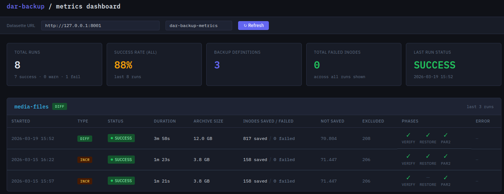
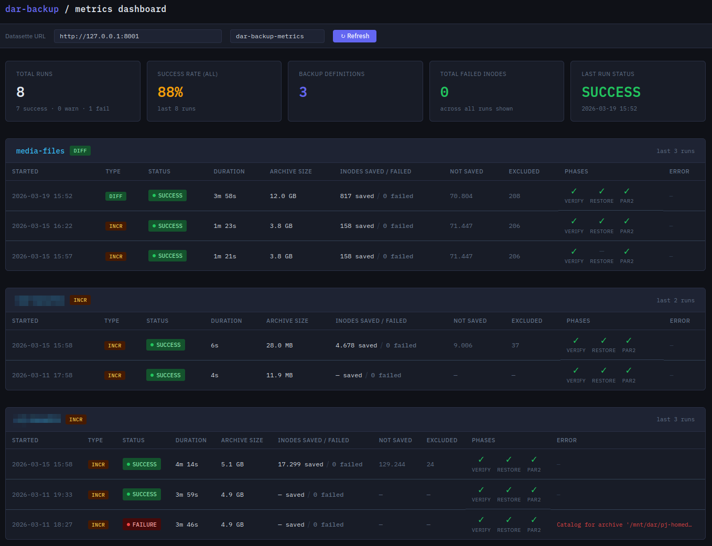

# Dashboard and Metrics

Back to [README](../../README.md)

## Dashboard

`dar-backup` ships a purpose-built metrics dashboard — a single HTML file that
queries the metrics database through Datasette and renders a summary of your
most recent backup runs directly in the browser.  No extra services, no
framework, no build step.

[](dar-backup-dashboard-full.png)

The full dashboard shows multiple backup definitions side by side, including how
a failed run is surfaced — highlighted in amber so it stands out immediately:

[](dar-backup-dashboard-full.png)

### What the dashboard shows

At the top, four summary metric cards give an instant health overview:

- Total runs recorded
- Success rate across all runs shown
- Number of distinct backup definitions
- Total failed inodes across all runs shown — the key indicator for FUSE-mounted
  storage issues such as the pCloud Crypto Folder (see [Troubleshooting: error code 5](troubleshooting.md#backup-warning-about-error-code-5))
- Status and timestamp of the most recent run

Below the summary, each backup definition gets its own section showing the last
three runs in a table with the following columns:

| Column | Description |
|--------|-------------|
| Started | Timestamp of the run |
| Type | `FULL`, `DIFF`, or `INCR` |
| Status | `SUCCESS`, `WARNING`, or `FAILURE` pill — colour coded |
| Duration | Total wall-clock time; hover for the dar / verify / par2 breakdown |
| Archive size | Total size of all `.dar` slices |
| Inodes saved / failed | Files saved and files that could not be saved — failed inodes are highlighted in amber or red |
| Not saved | Files unchanged since the last backup (expected for DIFF/INCR) |
| Excluded | Files skipped by filters |
| Phases | ✓ / ✗ for verify, restore test, and par2 |
| Error | First error message from the run, if any |

Rows with failed inodes are highlighted with a left amber border so they stand
out at a glance without needing to read every cell.

### Installation

```bash
. venv/bin/activate  # activate the virtual environment dar-backup in installed in
pip install dar-backup[dashboard]
```

This installs `datasette` as an optional dependency alongside `dar-backup`.
The dashboard HTML is bundled inside the package — no separate download needed.

### Starting the dashboard

```bash
# if venv is not activated
. venv/bin/activate  # activate the virtual environment dar-backup in installed in
dar-backup-dashboard
```

That is all.  The command:

1. Reads `METRICS_DB_PATH` from your dar-backup config file (same config
   resolution as `dar-backup` itself: `--config-file` → `DAR_BACKUP_CONFIG_FILE`
   env var → `~/.config/dar-backup/dar-backup.conf`)
2. Starts Datasette on port 8001 (or the next free port if 8001 is taken)
3. Waits for Datasette to be ready, printing a dot per second so you know
   something is happening
4. Opens the dashboard in your default browser

### Examples

```bash
# Use config file from a non-default location
dar-backup-dashboard -c /etc/dar-backup/dar-backup.conf

# Point directly at a specific database
dar-backup-dashboard --db ~/dar-backup/dar-backup-metrics.db

# Start on a different port
dar-backup-dashboard --port 8010

# Headless — print URL only, useful in scripts
dar-backup-dashboard --no-browser
```

### How it works

The dashboard is a single self-contained HTML file bundled in
`dar_backup/data/dashboard.html`.  When `dar-backup-dashboard` starts, it
launches Datasette with `--static dashboard:<html_dir>` so the file is served
at `http://127.0.0.1:<port>/dashboard/dashboard.html`.  The Datasette base URL
is appended as a `?datasette=` query parameter, so the dashboard connects to
the right instance automatically — no manual configuration in the browser UI
is needed.

The dashboard queries the metrics database directly via Datasette's JSON API
(`/<db>.json?sql=...`).  The Datasette URL field at the top of the page can be
edited and the Refresh button clicked if you want to point the dashboard at a
different Datasette instance.

Press `Ctrl+C` in the terminal to shut down Datasette when you are done.

---

## Metrics database

### Sqlite schema documentation

Every backup run appends one row to the `backup_runs` table in the SQLite
metrics database.  The database is created automatically on first use and
existing databases are migrated silently — columns added in later releases
are appended with `ALTER TABLE ADD COLUMN` so no data is lost.

Errors writing metrics are logged as `WARNING` and never abort a backup.

#### Run identification

| Column | Type | Description |
| --- | --- | --- |
| `id` | INTEGER | Auto-incrementing primary key. |
| `backup_definition` | TEXT | Name of the backup definition file. |
| `backup_type` | TEXT | `FULL`, `DIFF`, or `INCR`. |
| `archive_name` | TEXT | Base name of the dar archive, e.g. `homedir_FULL_2025-11-22`. |
| `hostname` | TEXT | Hostname of the machine that ran the backup (`socket.gethostname()`). |
| `dar_backup_version` | TEXT | dar-backup version string. |
| `dar_version` | TEXT | dar version string. |

#### Timing

| Column | Type | Description |
| --- | --- | --- |
| `run_started_at` | TEXT | ISO-8601 timestamp when the backup started. |
| `run_finished_at` | TEXT | ISO-8601 timestamp when the full run finished (including verify and par2). |
| `duration_secs` | REAL | Total wall-clock seconds for the entire run. |
| `dar_duration_secs` | REAL | Seconds spent in the dar backup phase only. |
| `verify_duration_secs` | REAL | Seconds spent in the verify phase. |
| `par2_duration_secs` | REAL | Seconds spent generating par2 redundancy files. |

#### Outcome

| Column | Type | Description |
| --- | --- | --- |
| `status` | TEXT | `SUCCESS`, `WARNING`, or `FAILURE`. |
| `dar_exit_code` | INTEGER | Raw exit code returned by dar (0 = success, 5 = some files skipped due to filesystem errors, etc.). |
| `failed_phase` | TEXT | `DAR`, `VERIFY`, or `PAR2` — set when a phase fails; NULL on success. |
| `error_summary` | TEXT | Short human-readable description of the first error encountered, or NULL. |
| `catalog_updated` | INTEGER | `1` if the dar manager catalog was updated successfully, `0` otherwise. |
| `verify_passed` | INTEGER | `1` if the archive integrity test passed. |
| `restore_test_passed` | INTEGER | `1` if the restore test passed. |
| `par2_passed` | INTEGER | `1` if par2 file generation succeeded. |

#### Archive size

| Column | Type | Description |
| --- | --- | --- |
| `archive_size_bytes` | INTEGER | Total size of all `.dar` slice files in bytes. |
| `num_slices` | INTEGER | Number of dar archive slices. |
| `par2_size_bytes` | INTEGER | Total size of all `.par2` files in bytes. |
| `files_verified` | INTEGER | Number of files verified during the verify phase. |
| `backup_dir_free_bytes` | INTEGER | Free space on the backup destination at run end. |

#### dar inode statistics

These columns are parsed from the summary block `dar` prints at the end of every
run (visible in the `*-commands.log`).  If dar changes its output format or the
run aborts before the summary is printed, the value is stored as `NULL` — the
backup is never affected.

```text
 --------------------------------------------
 6603 inode(s) saved
   including 0 hard link(s) treated
 0 inode(s) changed at the moment of the backup and could not be saved properly
 0 byte(s) have been wasted in the archive to resave changing files
 0 inode(s) with only metadata changed
 24695 inode(s) not saved (no inode/file change)
 5 inode(s) failed to be saved (filesystem error)
 9 inode(s) ignored (excluded by filters)
 0 inode(s) recorded as deleted from reference backup
 --------------------------------------------
 Total number of inode(s) considered: 31312
 --------------------------------------------
 EA saved for 0 inode(s)
 FSA saved for 0 inode(s)
```

| Column | Type | dar output line |
| --- | --- | --- |
| `inodes_saved` | INTEGER | `N inode(s) saved` |
| `hard_links_treated` | INTEGER | `including N hard link(s) treated` |
| `inodes_changed_during_backup` | INTEGER | `N inode(s) changed at the moment of the backup…` |
| `bytes_wasted` | INTEGER | `N byte(s) have been wasted in the archive…` |
| `inodes_metadata_only` | INTEGER | `N inode(s) with only metadata changed` |
| `inodes_not_saved` | INTEGER | `N inode(s) not saved (no inode/file change)` |
| `inodes_failed` | INTEGER | `N inode(s) failed to be saved (filesystem error)` — non-zero triggers dar exit code 5 |
| `inodes_excluded` | INTEGER | `N inode(s) ignored (excluded by filters)` |
| `inodes_deleted` | INTEGER | `N inode(s) recorded as deleted from reference backup` |
| `inodes_total` | INTEGER | `Total number of inode(s) considered: N` |
| `ea_saved` | INTEGER | `EA saved for N inode(s)` |
| `fsa_saved` | INTEGER | `FSA saved for N inode(s)` |

---

## Datasette

[Datasette](https://datasette.io) is a lightweight, zero-configuration tool for
exploring SQLite databases through a web browser.  It requires no server setup —
just point it at the metrics database and it renders tables, runs SQL queries,
and produces charts instantly.

### Installation

```bash
pip install datasette
```

### Starting the viewer

```bash
datasette ~/dar-backup/dar-backup-metrics.db
```

Open `http://127.0.0.1:8001` in a browser.  Datasette auto-detects all tables
and indexes.

### Useful queries

Browse all runs for a specific backup definition, newest first:

```sql
SELECT archive_name, backup_type, status, dar_exit_code,
       duration_secs, inodes_saved, inodes_failed, inodes_total
FROM   backup_runs
WHERE  backup_definition = 'homedir'
ORDER  BY run_started_at DESC;
```

Find all runs where files were skipped due to filesystem errors (dar exit code 5):

```sql
SELECT run_started_at, backup_definition, backup_type,
       inodes_failed, inodes_total, error_summary
FROM   backup_runs
WHERE  inodes_failed > 0
ORDER  BY run_started_at DESC;
```

Track backup size growth over time:

```sql
SELECT run_started_at, backup_type, archive_size_bytes,
       backup_dir_free_bytes
FROM   backup_runs
WHERE  backup_definition = 'homedir'
ORDER  BY run_started_at;
```

Show average backup duration per definition and type:

```sql
SELECT backup_definition, backup_type,
       ROUND(AVG(dar_duration_secs), 1)    AS avg_dar_secs,
       ROUND(AVG(verify_duration_secs), 1) AS avg_verify_secs,
       COUNT(*)                            AS runs
FROM   backup_runs
GROUP  BY backup_definition, backup_type
ORDER  BY backup_definition, backup_type;
```

### Persistent configuration with metadata.yml

Datasette supports a `metadata.yml` file that adds titles, descriptions, and
canned queries so the same useful views are always one click away:

```yaml
title: dar-backup metrics
description: Backup run history
databases:
  metrics:
    tables:
      backup_runs:
        description: One row per backup run
    queries:
      failed_files:
        title: Runs with filesystem errors
        sql: >
          SELECT run_started_at, backup_definition, backup_type,
                 inodes_failed, inodes_total, dar_exit_code
          FROM   backup_runs
          WHERE  inodes_failed > 0
          ORDER  BY run_started_at DESC
      recent_runs:
        title: Last 20 runs
        sql: >
          SELECT run_started_at, backup_definition, backup_type,
                 status, duration_secs, inodes_saved, inodes_total
          FROM   backup_runs
          ORDER  BY run_started_at DESC
          LIMIT  20
```

Start datasette with the configuration file:

```bash
datasette ~/dar-backup/dar-backup-metrics.db --metadata metadata.yml
```
